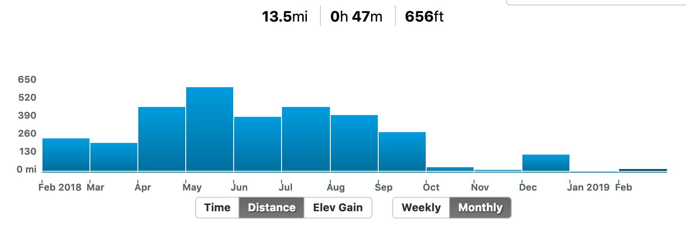
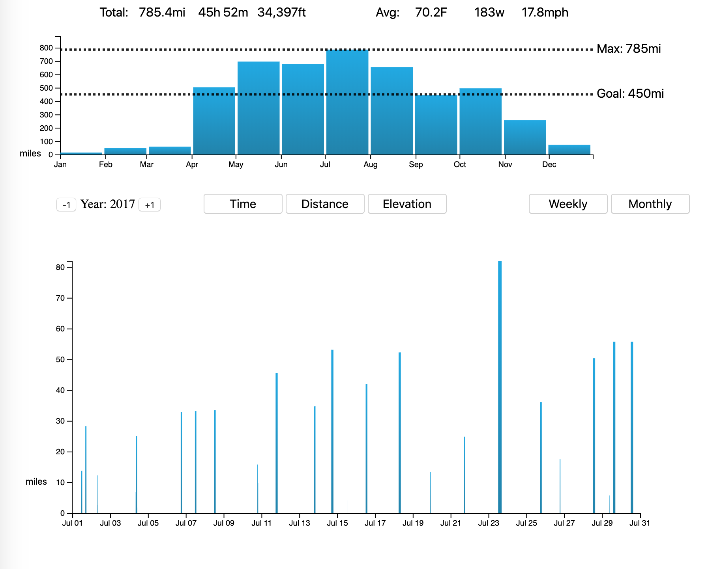

# RideVis
by Alexander Wurts  
[Visualization Link](https://ajwurts.github.io/RideVis/)

## Original Visualization

The original visualization is missing a few key features.  
1. Responsive Interactivity
    * The original visualization is interactive but it takes 3-5 seconds to load after clicking any column.
2. The user goal for this graph would be comparing previous weeks athletic data. Having a maximum line and a goal threshold would better enable the user to understand their data  
    * Users are able to set a weekly or monthly goal, but this graph doesn't show it.
3. Doesn't visualize the routes within a week effectively. It displays a list of routes instead of utilizing a visual component. When searching for a ride it makes it much more difficult find.

## New Visualization

The visualization looks at three different variables for all of my bicycle rides for a given year aggregated by weeks or months. They can look at the rides through total time, distance, or elevation. At the top of the graph is the summary data for the bar being hovered over. The top left shows the summation. The top right side shows the average. You can change the year by clicking the +1 and -1 on the bottom left. I recommend looking at 2017 or 2018 they have the most data. A secondary visual is opened when the user clicks any one of the months or weeks to look at the rides that make up that time period. In the secondary visual the width of the bar represents the length of the ride, and the height is based off which variable they currently have selected. When the user hovers over a bar in the secondary visual a line of text appears below the chart with the details for that ride. If you click on a ride in the secondary chart it brings up the ride on Strava in another browser window
